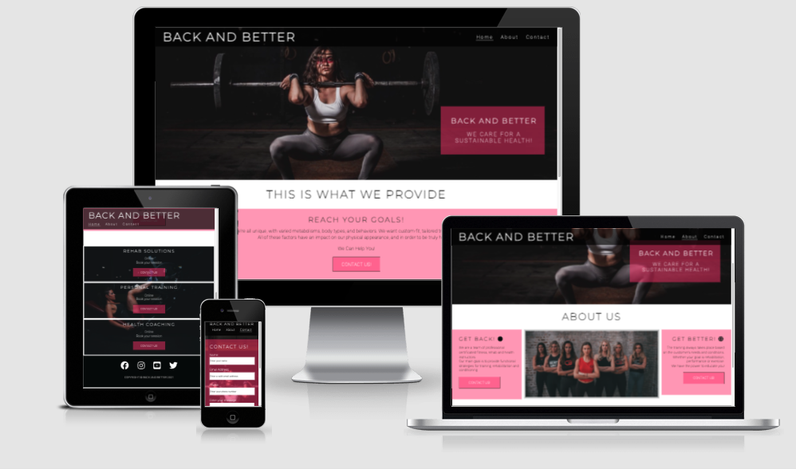

# Back AND Better

Back and Better is a site that aims to help women with there health and fitness goals as well as provide them with rehab solutions.

---
## User Stories:

- I need to view the page on mobile devices.
- I want to view information about sessions.
- I want to view information about the instructors.
- I will look for contact information and social media links.
- I want to make contact or book a session. 
- I want to know the price of different sessions.
---
## Five Planes:

#### - Strategy (What this website aims to achive, and for whom.)

The website aims to offer visually appealing and accesible information, that is requested by user stories. The main goal of the website is to attract women to to fill out the contact form.  

#### - Scope (Which features, based on information from the strategy plane, do you want to include in your design?)

To make the site easy to use and accessible, it should be properly. 

#### - Structures (How is the information structured and how is it logically grouped?)

Pages: Home, About, Contact

- The home page 
- The about page 
- The contact page is a clean and simple contact-us form. 

#### - Skeleton (How will our information be represented, and how will the user navigate to the information and the features?)
###### Wireframes:

- [Desktop_Home_page]()
- [Mobile_Home_page]()
- [Desktop_About_page]()
- [Mobile_About_page]()
- [Desktop_Contact_page]()
- [Mobile_Contact_page]()

#### - Surface (What will the finished product look like? - What colors, typography, and design elements will we use?)

I have used a background image of a face painted girl who lifts a barbell for the home, about and contact page. I have tried to reuse the colors from the image through out the rest of the website.

---
## Technologies used:
- HTML 5
- CSS 3
- [FontAwesome](https://fontawesome.com/) for icons.
- [Google_Fonts](https://fonts.google.com/)
- [GitHub_Pages](https://pages.github.com/) was used for deployment.
- [Mockup_screenshot_generator](http://ami.responsivedesign.is/#) was used to generate a mockup for this readme.

---
## Features

<em>ou will need to explain what value each of the features provides for the user, focusing on who this website is for, what it is that they want to achieve and how your project is the best way to help them achieve these things.</em>

### Existing Features

- __Navigation Bar__

  - Featured on all three pages, the full responsive navigation bar includes links to the Logo, Home page, About page and Contact page and is identical in each page to allow for easy navigation.
  - This section will allow the user to easily navigate from page to page across all devices without having to revert back to the previous page via the ‘back’ button. 