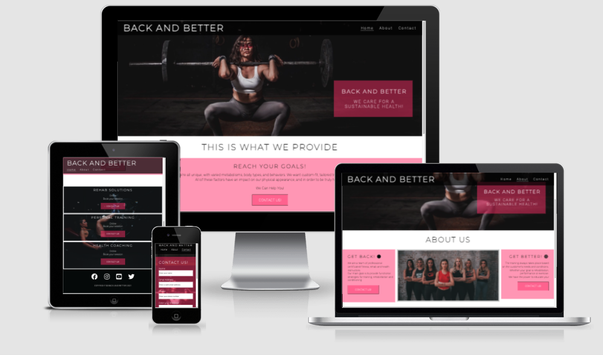
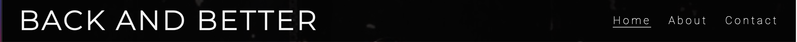
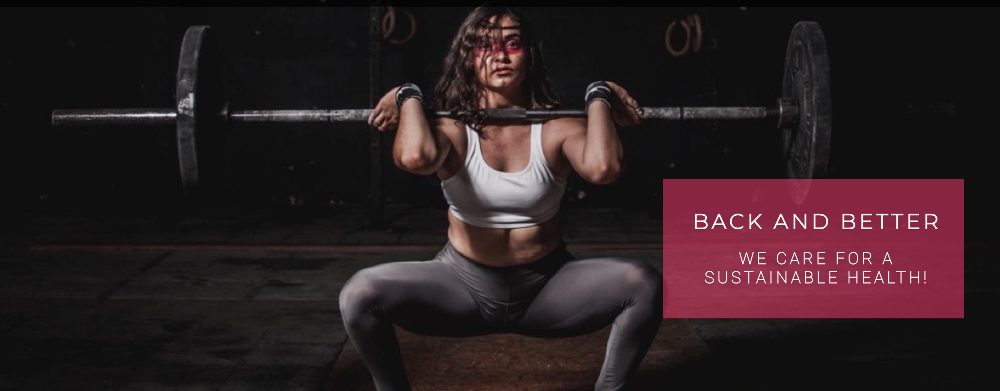
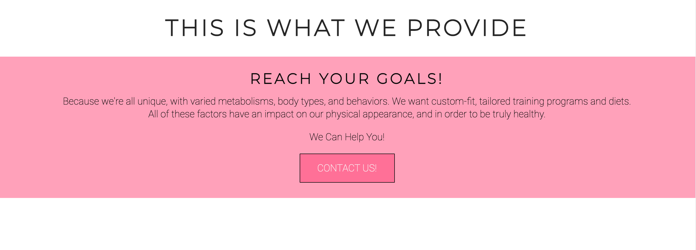
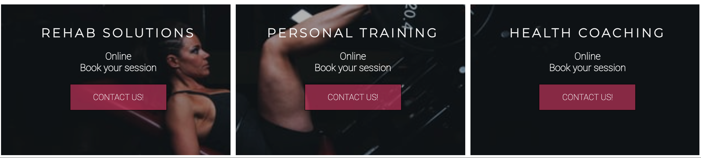
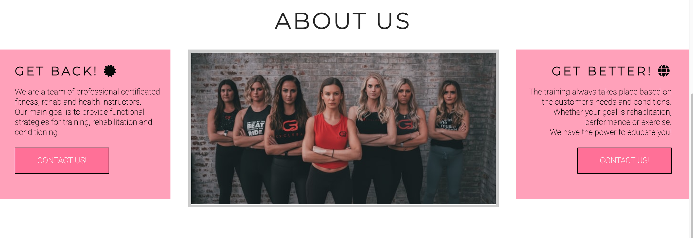
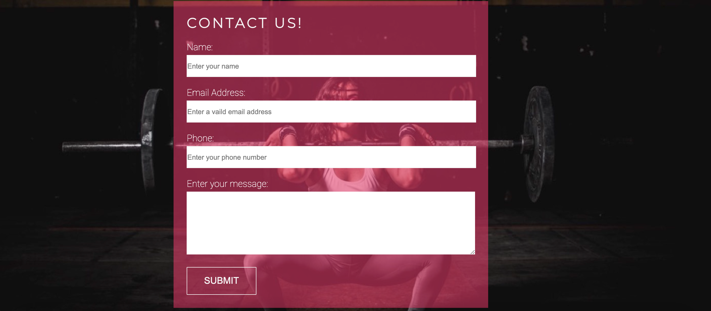

# Back AND Better

Back and Better is a site that aims to help women with rehabilitation solutions as well as provide them with sustainable health and fitness goals.

---
## User Stories:

- I need to view the page on mobile devices.
- I want to view information about sessions.
- I want to view information about the instructors.
- I will look for contact information and social media links.
- I want to make contact or book a session. 

---
## Five Planes:

#### - Strategy (What this website aims to achive, and for whom.)

The website aims to offer visually appealing and accesible information, that is requested by user stories. The main goal of the website is to attract women to to fill out the contact form.  

#### - Scope (Which features, based on information from the strategy plane, do you want to include in your design?)

The website should have user-friendly navigation. The user should be able to quickly access social media links and fill out a contact form to get more information. 

#### - Structures (How is the information structured and how is it logically grouped?)

Pages: Home, About, Contact

- The home page first view will be simple in structure with a short text intro and a call to action button.
Below it will contain some information about the sessions types. The footer will contain social media links.
- The about page will contain some information about the company ethos.
- The contact page is a clean and simple contact-us form. 

#### - Skeleton (How will our information be represented, and how will the user navigate to the information and the features?)
###### Wireframes:

- [Desktop_Home_page](wireframes/home_desktop.png)
- [Mobile_Home_page](wireframes/home_mobile.png)
- [Desktop_About_page](wireframes/about_desktop.png)
- [Mobile_About_page](wireframes/about_mobile.png)
- [Desktop_Contact_page](wireframes/contact_desktop.png)
- [Mobile_Contact_page](wireframes/contact_mobile.png)

#### - Surface (What will the finished product look like? - What colors, typography, and design elements will we use?)

I have used a background image of a face painted girl who lifts a barbell for the home, about and contact page. I have tried to reuse the colors from the image through out the rest of the website.

---
## Technologies used:
- HTML 5
- CSS 3
- [FontAwesome](https://fontawesome.com/) for icons.
- [Google Fonts](https://fonts.google.com/)
- [GitHub Pages](https://pages.github.com/) was used for deployment.
- [Mockup screenshot generator](http://ami.responsivedesign.is/#) was used to generate a mockup for this readme.

---
## Features:

### Existing Features:

__Navigation Bar__

- Featured on all three pages, the full responsive navigation bar is fixed and includes links to the Logo, Home page, About page and Contact page and is identical in each page to allow for easy navigation.
- This section will allow the user to easily navigate from page to page across all devices without having to revert back to the previous page via the ‘back’ button. 

__The landing page image__

- The landing page includes a photograph with text overlay to attend the user about a sustainable health. 
- This section introduces the user to Back and Better with an eye catching animation to grab their attention.

__Home Intro Section__

- The home intro section is kept simple with a motivation quote to focus attention on the call to action button.

__Session Section__ 

- This section will allow the user to see exactly what sessions the site offers and that they are located online. 
- This section is kept simple to focus attention on the call to action button.
- The links to different sessions types on the home page will link to the contact form on the contact page.
- The sessions will stack horizontally on smaller screens. 

__The Footer__ 

- The footer section includes links to the relevant social media sites for Back and Better. The links will open to a new tab to allow easy navigation for the user. 
- The footer is valuable to the user as it encourages them to keep connected via social media.

__About Us page__

- The About Us page will provide the user with supporting and appealing information about the company and the instructors.
- This section is valuable to the user as they will be able to easily identify and relate to the ethos .
- The information on the about page will stack horizontally on smaller screens.

__The Contact page__

- The Contact page is a simple contact form where the user will be asked to submit their full name, email address and phone number. The user will be able to specify some extra information in the textarea.

### Features Left to Implement:
- Home Page
  - Session section will be updated with more information. 
- About Page: 
  - Will be updated with more information about the specific instructors.

---
## Implementation and Process:
- I started coding with a navbar and a background image for the home page (index file). I separated the body into three sections, the header, the content and then the footer. 
- I added some introductory text on the home page.  
- I added a session section in the home page.
- I added social links to the footer.
- I created two more files: about and contact and pasted the content from the index file. 

After the initial planning session with my mentor I needed to: 
- Start with my wireframes for tablet and mobile devices (rookie misstake not doing it ahead as well as the UX planning).
- I added some introductory text on the about page.
- I added a form to the contact page.
- 1 added call to action buttons on the home page and on the about page.

After my mid-project session with my mentor I had the following changes to implement:
- Center align buttons and content.
- Implement css variables to shorten organize multiple code values.

After my end-of-project mentor session I had the following changes to implement:
- Change id attributes to class attributes through out the pages.
- Shorten the image names in the images folder.
- Add aria-labels to the links on the pages.
- Correct the responsive layout and media queries through out the pages. 

---  
## Testing:

- I ensured that all links directed to the correct pages and that certain links directed to specific sections of other pages.
- I ensured that all links to external websites opened in a new tab
- I tested the form validation and the submit button
- I used the following desktop browsers for testing:
  - Google Chrome
  - Safari Browser
- I tested the site on a Huawei P30 Pro with the following mobile browsers:
  - Google Chrome
  - Huawei Browser
- I tested the site on a Ipad (5:th gen) with the following browsers:
  - Safari Browser
- I tested responsiveness with Google Chrome Developer Tools.
- All browsers mentioned were updated to the latest version as of 22/06/2021.

### Validator Testing:

- HTML
  - [W3C HTML Validation Service](https://validator.w3.org/) No errors were returned.
- CSS
  - [(Jigsaw) Validator](https://jigsaw.w3.org/css-validator/) No errors were found.

### Unfixed Bugs
  
Form buttom doesnt lead anywhere because there´s no action or method attributes applied at this point.
  
---
## Deployment
The site was deployed to [GitHub pages](https://pages.github.com/). Using the following steps: 
- Create a repository on GitHub and initialize it with a README.MD file
- The root of your repository must contain an index.html file which will be the main page of your live GitHub Page.
- Go to repository settings, scroll to GitHub Pages and select the master branch for your source.
- Save the selection and when the page reloads the link to your live site will be in the GitHub Pages section. The link can take up to 1 hour to go live.

The live link can be found here - https://github.com/Sndrahel/Back-AND-Better.git
  
---
## Credits

#### Content
- The template and inspiration of this README.md is partly taken from:
    - [oisintohak / The Drum School / README.md](https://github.com/oisintohak/The-Drum-School---MS1/blob/9df9f673e676c2308567fe43af6e8b9cb19fdfeb/README.md) 
    - [Code Institute / Love Running / README.md](https://github.com/Code-Institute-Solutions/readme-template.git)
    
- The styling are through out inspired and taken from:
    - [Code Institute / Love Running 2.0](https://github.com/Code-Institute-Org/love-running-2.0.git)

#### Media
- The Images on this website were taken from: 
    - [Unsplash](https://unsplash.com/)
    - [Pexels](https://pexels.com/)

- The icons were taken from [FontAwesome](https://fontawesome.com/)
 
---
## Acknowledgments

- Nishant Kumar: my Code Institute mentor who guided me through this process and shared a lot of valuable knowledge.

  